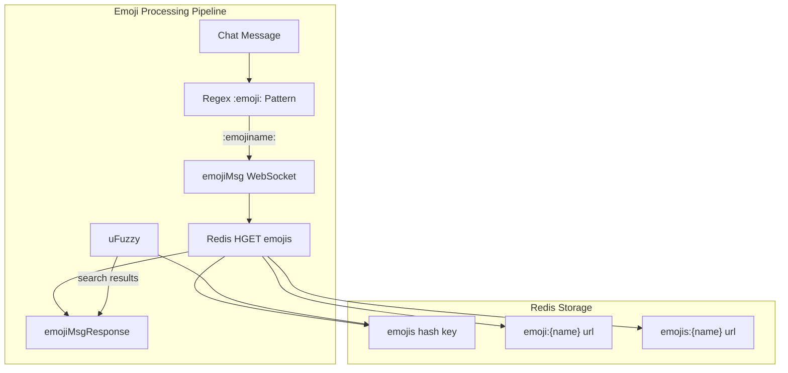

import { Aside } from '@astrojs/starlight/components';

The chat system is powered by a websocket server. Please read the entire page before implementing anything, as there are some important notes.

## Connection and messages

The websocket server is located at `wss://hackclub.tv/api/chat/ws/:username`, where `:username` is the channel you want to connect to.

You'll need to provide authentication, which can be done by providing an `auth_session` cookie, just like the REST API.

<Aside type="tip">
Bot accounts are now supported. You can choose to connect as a bot by providing a bot account's API key in one of two ways:
- Using the `Authorization` header: `Bearer hctvb_xxxxxxx` (for server-side connections) **[Recommended]**
- Using the `?botAuth=hctvb_xxxxxxx` query parameter (for browser-based connections, since browsers cannot set custom headers on WebSocket connections)

**Security Note:** When using the `?botAuth=` query parameter, be aware that query parameters may be logged in browser history, server logs, and proxy logs. Use the `Authorization` header method whenever possible. The query parameter method should only be used when connecting from a browser environment where headers cannot be set.

It is highly advised to use a bot account for any automated task, and to implement anything pointed out in this page.

</Aside>

Once connected, you must implement a subroutine in your code to send ping messages every about 5 seconds. This is because of Cloudflare limitations.

Messages are sent and received in JSON format. The following message types are supported:

- `message`: a chat message.
  - sent by client:
    ```json
    {
      "type": "message",
      "content": "Hello, world!"
    }
    ```
  - received by client:
    ```json
    {
      "user": {
        "id": "user_id",
        "username": "user_who_sent_message",
        "avatar": "https://emoji.slack-edge.com/avatar.png"
      },
      "message": "Hello, world!"
    }
    ```
- `ping`: a ping message to keep the connection alive.
  - sent by client:
    ```json
    {
      "type": "ping"
    }
    ```
  - received by client:
    ```json
    {
      "type": "pong"
    }
    ```
- `history`: a message containing the chat history. This is sent upon connection.
  - received by client:
    ```json
    {
      "type": "history",
      "messages": [
        {
          "user": {
            "id": "user_id",
            "username": "user_who_sent_message",
            "avatar": "https://emoji.slack-edge.com/avatar.png"
          },
          "message": "Hello, world!",
          "type": "message",
        },
        ...
      ]
    }
    ```

## Emoji handling

_diagram source: devin deepwiki_



When a chat message is sent, the server looks for patterns in the format `:emojiname:` using regex. For each match, it sends a request to the `emojiMsg` WebSocket.  
The server then checks Redis for the emoji URL and returns it.

When a user wants to look up an emoji (by typing `:(partial name)`), the server uses uFuzzy to find matching emojis in the Redis `emojis` hash key and returns the results.

Here's what gets sent on the websocket:

- `emojiMsg`: Looks up emojis
  - sent by client:
    ```json
    {
      "type": "emojiMsg",
      "emojis": ["aga", "yapa", "heavysob", "yay", "yay-bounce"]
    }
    ```
  - received by client:
    ```json
    {
      "type": "emojiMsgResponse",
      "emojis": {
        // rough example of urls
        "aga": "https://emoji.slack-edge.com/aga.png",
        "yapa": "https://emoji.slack-edge.com/yapa.png",
        "heavysob": "https://emoji.slack-edge.com/heavysob.png",
        "yay": "https://emoji.slack-edge.com/yay.png",
        "yay-bounce": "https://emoji.slack-edge.com/yay-bounce.png"
      }
    }
    ```
- `emojiSearch`: Searches for emojis
  - sent by client:
    ```json
    {
      "type": "emojiSearch",
      "searchTerm": "aga"
    }
    ```
  - received by client:
    ```json
    {
      "type": "emojiSearchResponse",
      "results": [
        // real results btw
        "aga",
        "aga-brick-throw",
        "aga-dance",
        "aga-transparent",
        "a-aga",
        "a-aga-transparent",
        "agaban",
        "agaboing",
        "agabounce",
        "agabusiness"
      ]
    }
    ```
