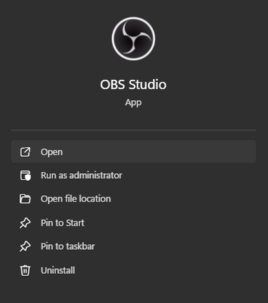
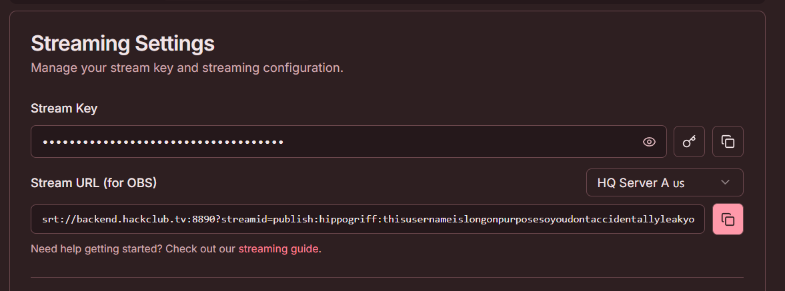
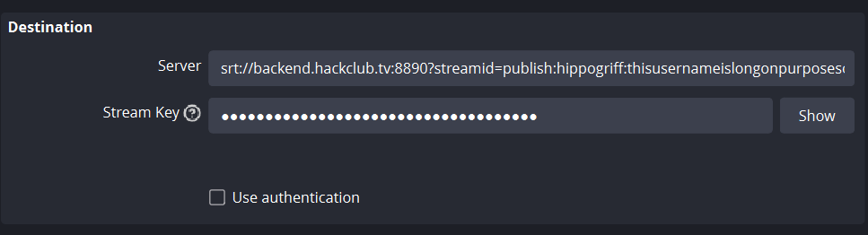

_This guide demonstrates how to stream with hackclub.tv via OBS Studio. For other streaming software, you will need to adapt these steps for your chosen software._

- Open OBS Studio.

(_If it is not installed, head to [this webpage](https://obsproject.com/) to download the installer._)

- In OBS, click `File > Settings` in the top navigation bar.

- In the Settings popup, open `Stream` from the sidebar.

- Set `Service` to `Custom...`.

- Go to https://hackclub.tv/settings/channel/ in your web browser.

(_If you are not logged in, you may have to log in again and then try again._)

- Under `Stream Settings`, you will find your `Stream Key` and `Stream URL`. Copy the `Stream URL` and paste it into OBS.

- Go back to the website and click this <svg xmlns="http://www.w3.org/2000/svg" width="24" height="24" viewBox="0 0 24 24" fill="none" stroke="currentColor" stroke-width="2" stroke-linecap="round" stroke-linejoin="round" class="lucide lucide-key h-4 w-4"><path d="m15.5 7.5 2.3 2.3a1 1 0 0 0 1.4 0l2.1-2.1a1 1 0 0 0 0-1.4L19 4"></path><path d="m21 2-9.6 9.6"></path><circle cx="7.5" cy="15.5" r="5.5"></circle></svg> icon to regenerate your stream key. Copy the new key and paste it into the `Stream Key` box in OBS.

(_Your OBS settings should now look like this_)

- You can now safely apply the changes in OBS and start streaming.

Thanks for using this guide and happy streaming!

_A video tutorial is currently being made, so check back later if you would like to see it!_
